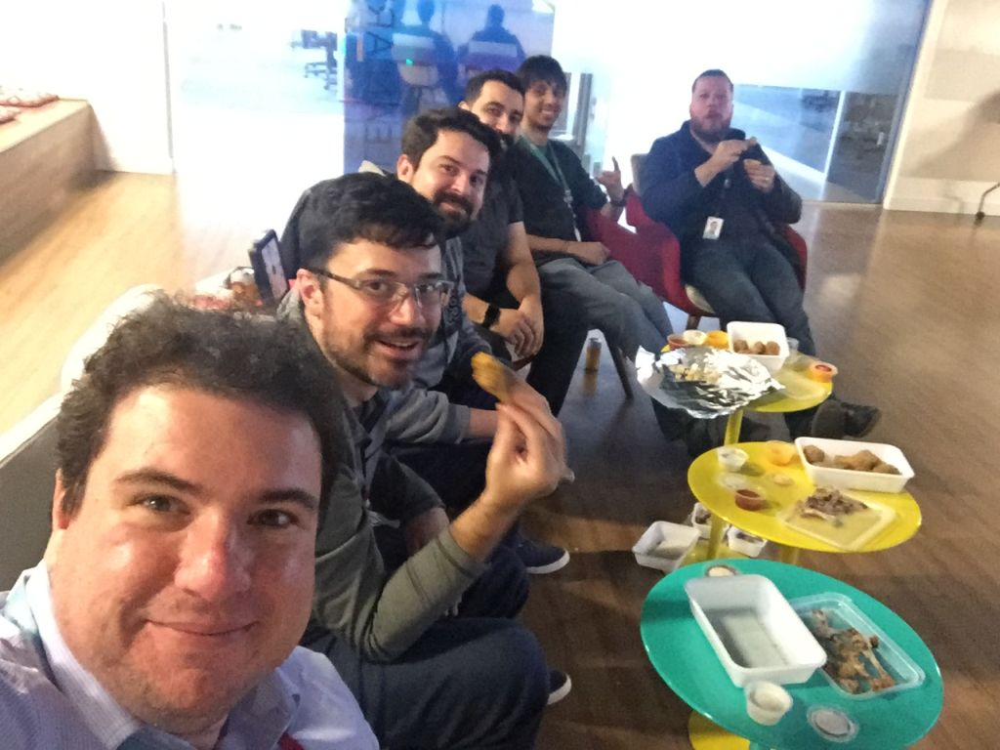
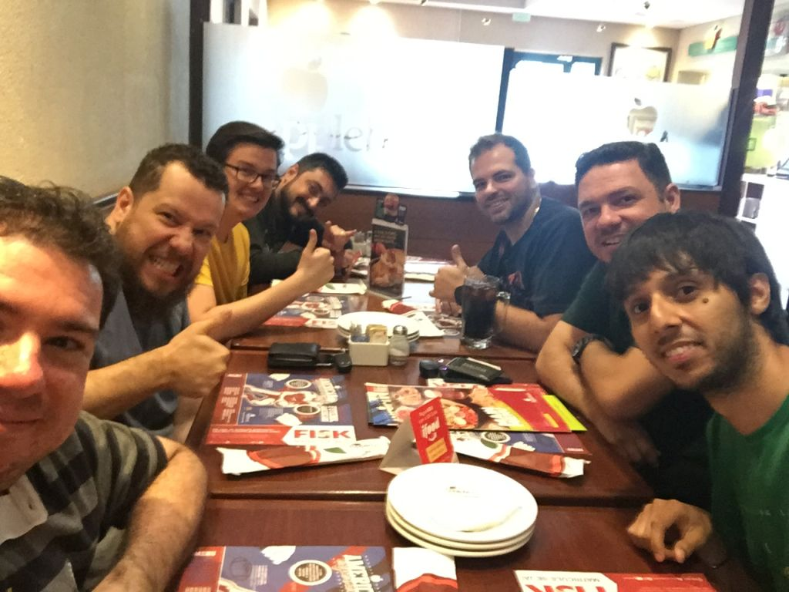
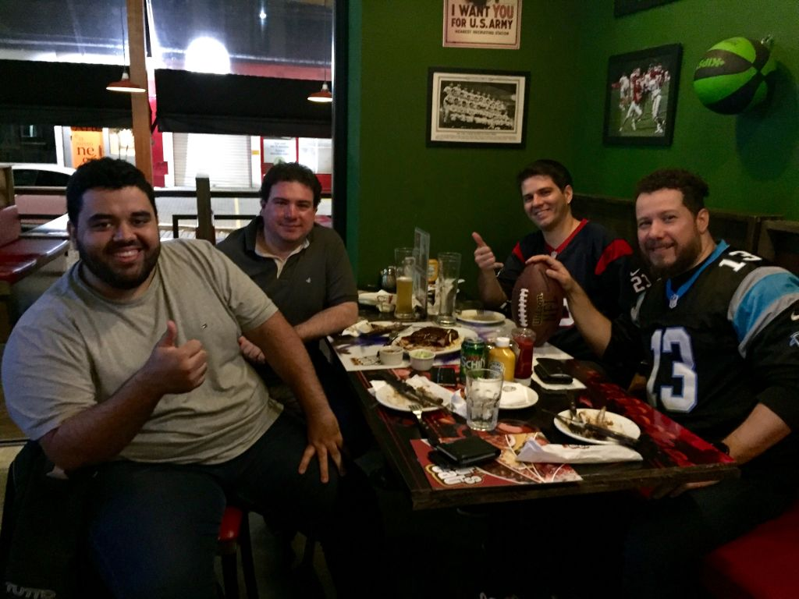
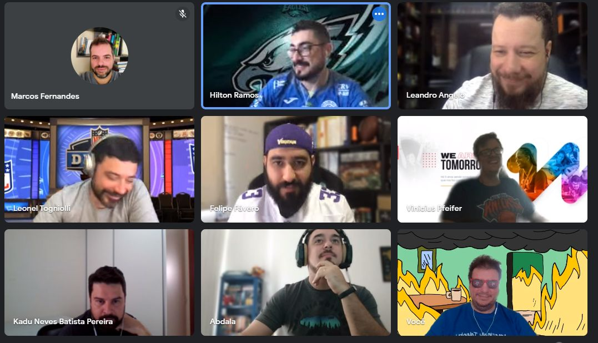

## OMG!

It's the 7th season (SEVENTH!!!) of **"It's football, dudes!" NFL Fantasy League**

## Photo Gallery

### NFL Kickoff 2019

### Fantasy Superbow Lunch 2019

### NFL Kickoff 2016

### 2021 Remote Draft Lunch

## Long Story Short

It's our 7th season and the 4th supported by _[R](https://www.r-project.org/)_ as our [analytics](https://yetanotheriteration.netlify.app/2018/10/forecasting-fantasy-games-using-monte-carlo-simulations/) platform to projection player performance and do match simulations, and the 3rd year we use the combo _[blogdown R package](https://github.com/rstudio/blogdown)_ + _[Hugo](https://gohugo.io/)_ + _[Netlify](https://www.netlify.com/)_.

## New site

In this offseason the [blogdown](https://github.com/rstudio/blogdown) R package had a [major update](https://blog.rstudio.com/2021/01/18/blogdown-v1.0/), changing the way the package organize the content and use Hugo (the `/public` folder has gone!).

To make the things easy (and because I was going crazy trying to merge the legacy pages with the new package version without have to render all the two years of Rmarkdown documents again) I decided to split the content, move the legacy pages to a new domain and start the new season's site from scratch.

So, that is it, this is the new site: [dudesfootball](https://dudesfootball.netlify.app/), the old site, data and report was moved to this domain: [olddudesfootball](https://olddudesfootball.netlify.app/) for historic reasons!

Let's do some Fantasy Football (Analytics)!!

