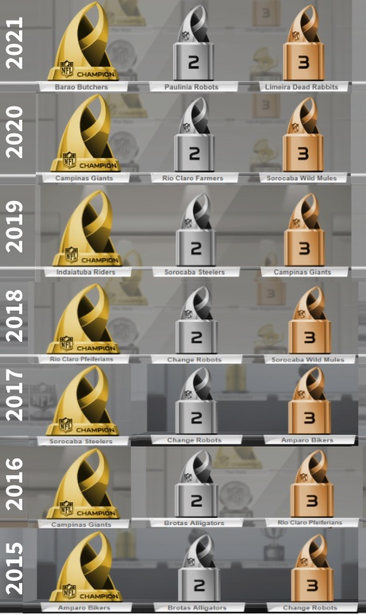

Remembering our champions...

<!--more-->

## Champions

### Season 2021
🏆 1st Place: **Barão Butchers** (Kadu) 
🥈 2nd Place: **Paulínia Robots** (Leonel) 
🥉 3rd Place: **Limeira Dead Rabbits** (Danilo) 
 
🥇️ Reg Season 1st Place: **Indaiatuba Riders** (Langas) 
🎖 Highest Scoring: **Paulínia Robots** (Leonel) 
🏅 Survival Champion: **Paulínia Robots** (Leonel) 

### Season 2020
🏆 1st Place: **Campinas Giants** (Teixeira) 
🥈 2nd Place: **Rio Claro Farmers** (Vini) 
🥉 3rd Place: **Sorocaba Wild Mules** (Hilton) 
 
🥇️ Reg Season 1st Place: **Sorocaba Wild Mules** (Hilton) 
🎖 Highest Scoring: **Gonçalvez Miners** (Fávero) 
🏅 Survival Champion: **Gonçalvez Miners** (Fávero) 

### Season 2019
1. Indaiatuba Riders - Owner: Langas
1. Sorocaba Steelers - Onwer: Marcão
1. Campinas Giants - Owner: Teixeira

### Season 2018
1. Rio Claro Pfeiferians - Owner: Vini
1. Paulínia Robots - Onwer: Leonel
1. Sorocaba Wild Mules - Owner: Hilton

### Season 2017
1. Sorocaba Steelers - Onwer: Marcão
1. Paulínia Robots - Onwer: Leonel
1. Amparo Bikers - Owner: Giul

### Season 2016
1. Campinas Giants - Onwer: Teixeira
1. Brotas Alligators - Onwer: Gilson
1. Rio Claro Pfeiferians - Owner: Vini

### Season 2015
1. Amparo Bikers - Onwer: Giul
1. Brotas Alligators - Onwer: Gilson
1. Paulínia Robots - Owner: Leonel